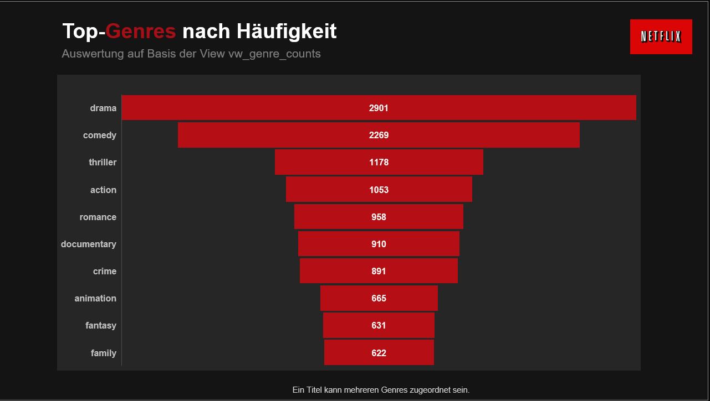
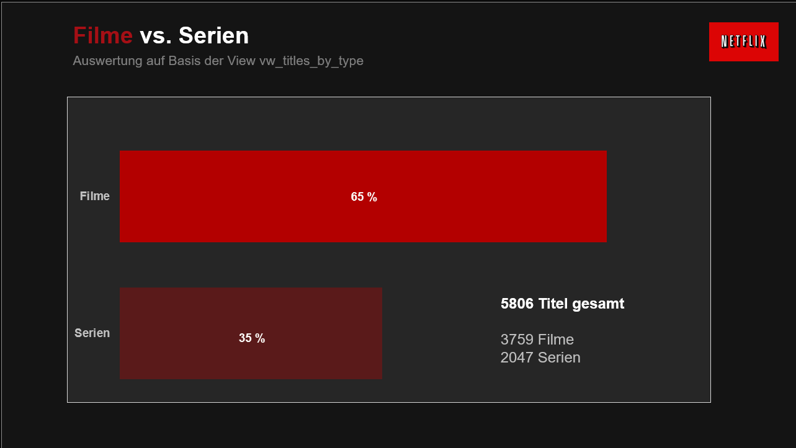
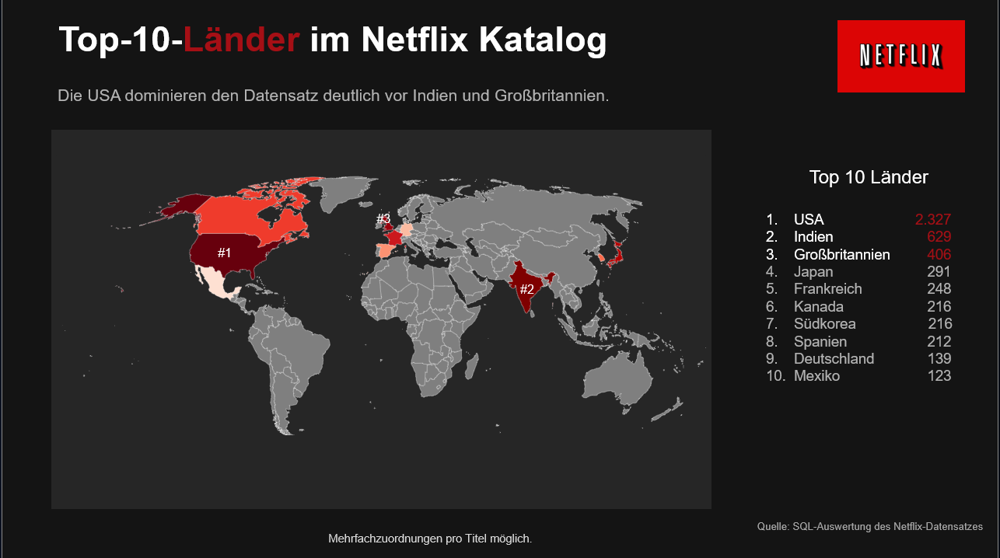
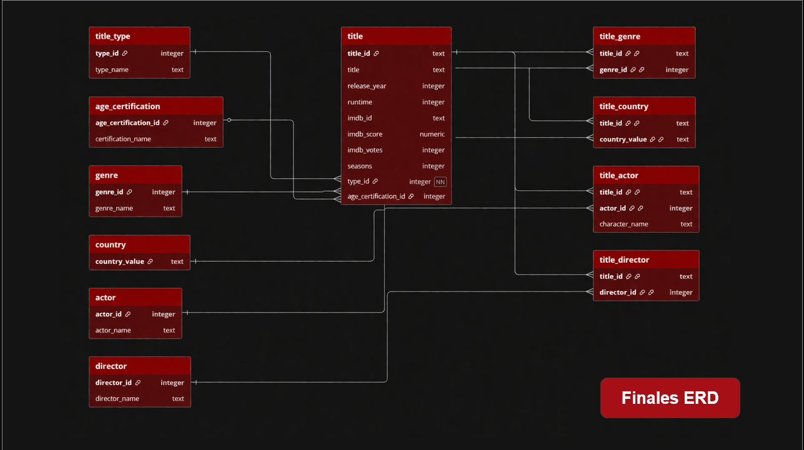

# SQL Netflix Analysis
A structured SQL portfolio project transforming raw Netflix data into a relational model and actionable insights.

## Project Overview
This project explores Netflix titles and credits data using SQL.

The goal was to transform raw CSV data into a structured relational model, analyze the content catalog, and derive clear business-oriented insights from SQL queries.

The project focuses on:
- building a relational data model
- cleaning and standardizing raw data
- analyzing catalog structure and trends
- interpreting SQL-based results in a meaningful way

---

## Project Goal
The purpose of this project was to answer questions such as:

- How is the Netflix catalog structured?
- What is the distribution of movies and series?
- Which genres occur most frequently?
- Which countries contribute the most titles?
- How has the catalog developed over time?
- Which directors, runtimes, season counts, and IMDb ratings stand out?

---

## Tools Used
- SQL
- PostgreSQL
- CSV data sources
- Relational data modeling
- Views for reusable analysis logic
- GitHub for documentation and project structure

---
## Key Skills Demonstrated
- SQL querying and aggregation
- relational data modeling (1:n, m:n)
- data cleaning and normalization
- analytical thinking and interpretation

## Example Analysis: Top Genres

```sql
SELECT g.genre, COUNT(*) AS total_titles
FROM title_genre tg
JOIN genre g ON tg.genre_id = g.genre_id
GROUP BY g.genre
ORDER BY total_titles DESC;
```
This query calculates the number of titles per genre and highlights the most common genres in the dataset.



## Example Analysis: Movies vs Series

```sql
SELECT type, COUNT(*) AS total_titles
FROM titles
GROUP BY type;
```
This query compares the number of movies and TV shows available in the dataset, providing insight into Netflix's content distribution.



## Example Analysis: Top Countries

```sql
SELECT country, COUNT(*) AS total_titles
FROM titles
WHERE country IS NOT NULL
GROUP BY country
ORDER BY total_titles DESC
LIMIT 10;
```
This query identifies the countries with the highest number of titles in the dataset, highlighting where most Netflix content originates.



## Dataset
The project is based on cleaned Netflix titles and credits data stored in CSV files.

Main source files:
- `data/titles_clean.csv`
- `data/credits_clean.csv`

The raw data included several structural challenges, such as:
- multi-value attributes in genre, country, actor, and director
- missing or inconsistent values
- attributes that were not directly analysis-ready
- the need for plausibility checks and quality control

---

## Source / Reference
This project is based on the Netflix dataset project by Arpita Deb.

Original reference:
https://github.com/Arpita-deb/netflix-movies-and-tv-shows

This repository reflects my own adaptation and further development of the topic, including the relational schema, SQL analysis, presentation, and documentation for my SQL final project.

---

## Methodology
The workflow followed a structured process from raw data to analysis-ready SQL outputs:

1. Analyze the raw dataset
2. Import cleaned CSV data into PostgreSQL
3. Standardize data types and attribute values
4. Normalize the data into a relational structure
5. Define keys and relationships
6. Create reusable views for standard analysis
7. Run SQL queries and interpret the results

---

## Data Model
A relational schema was designed around the central `title` table to enable structured analysis of Netflix content.

### Entity Relationship Diagram (ERD)



This ERD shows the relational structure of the dataset, including the relationships between titles, genres, and other entities.

---

### Core entities
- `title`
- `title_type`
- `age_certification`
- `genre`
- `country`
- `actor`
- `director`

### Relationship tables
- `title_genre`
- `title_country`
- `title_actor`
- `title_director`

### Relationship logic
- `title_type` and `age_certification` are modeled as **1:n** relationships to `title`
- `genre`, `country`, `actor`, and `director` are modeled as **m:n** relationships using bridge tables

This design makes the dataset much more flexible and analysis-ready than the original raw structure.

---

## Views Used
To simplify recurring SQL analyses, reusable views were created:

- `vw_titles_per_year` → number of titles per release year
- `vw_genre_counts` → genre frequencies in the dataset
- `vw_titles_by_type` → distribution of movies and series

Views helped encapsulate frequently used logic and made standard evaluations easier to reproduce.

---

## Key Findings
Some of the main findings from the project were:

- The dataset contains **5,806 titles** in total
- **65%** of the catalog consists of movies and **35%** of series
- The most frequent genres are **Drama**, **Comedy**, and **Thriller**
- The catalog is much more strongly represented in recent years
- The **USA** clearly dominates the dataset, followed by **India** and **Great Britain**
- Further analysis highlighted notable directors, unusually long movies, series with many seasons, genre trends, IMDb score patterns, and audience structure by age certification

---

## Repository Structure
```text
SQL-Netflix/
├── README.md
├── data/
│   ├── credits_clean.csv
│   └── titles_clean.csv
├── sql/
│   ├── tasks.sql
│   ├── erd_setup.sql
│   └── queries.sql
└── docs/
    ├── netflix-presentation.pdf
    ├── project-task.pdf
    └── screenshots/
        ├── final-erd.png
        ├── movies-vs-series.png
        ├── top-countries.png
        └── top-genres.png
```


